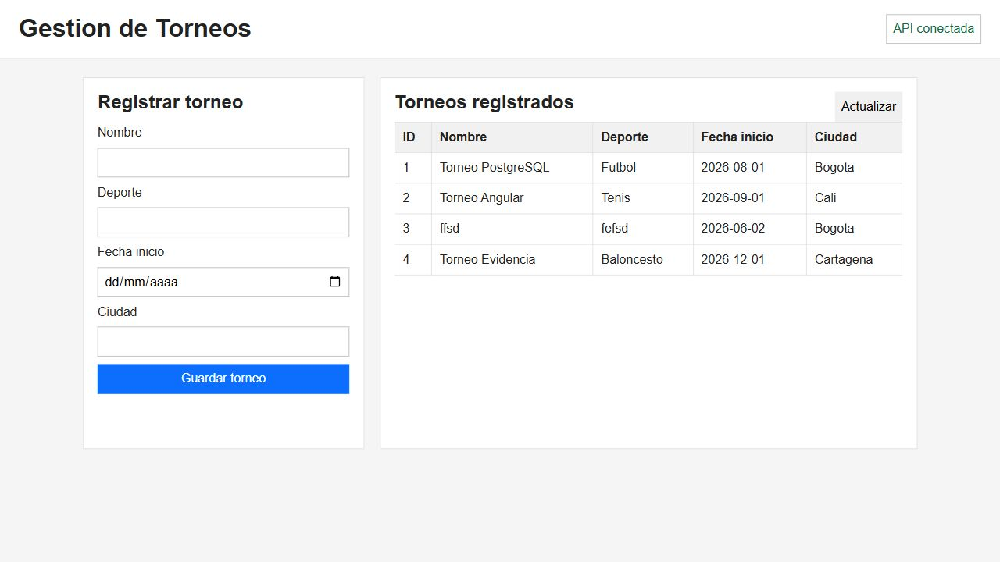

# ParcialWebRepo2

Frontend Angular simple para gestionar torneos.

## Funciones

- Formulario para crear torneos.
- Tabla para listar torneos.
- Consumo del backend en `http://localhost:8080/api/torneos`.

No incluye formulario ni tabla para `Equipo`.

## Pruebas y evidencias

En esta seccion se pueden anexar capturas de las pruebas solicitadas.

### Base de datos y relacion


### Formulario de insercion y tabla de consulta

La siguiente captura muestra:

- Formulario Angular para registrar torneos.
- Tabla de torneos registrados.
- Datos consultados desde el backend.
- Estado de conexion `API conectada`.



### Formulario funcionando


### Endpoint usado por el formulario

```text
POST http://localhost:8080/api/torneos
```

### Endpoint usado por la tabla

```text
GET http://localhost:8080/api/torneos
```


